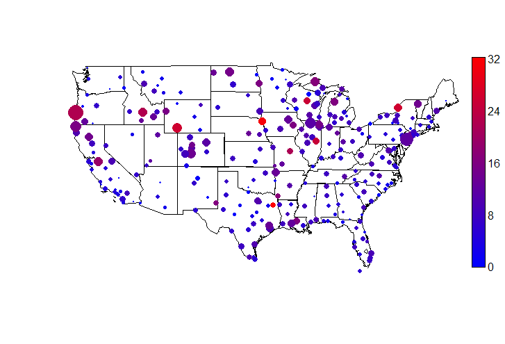
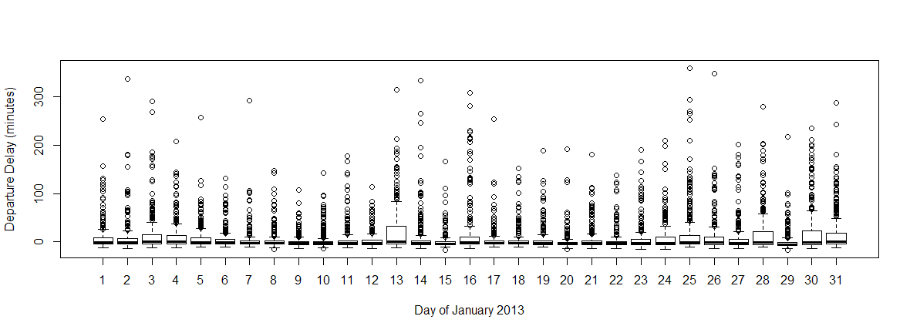
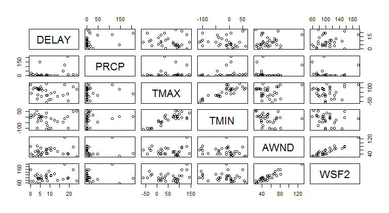
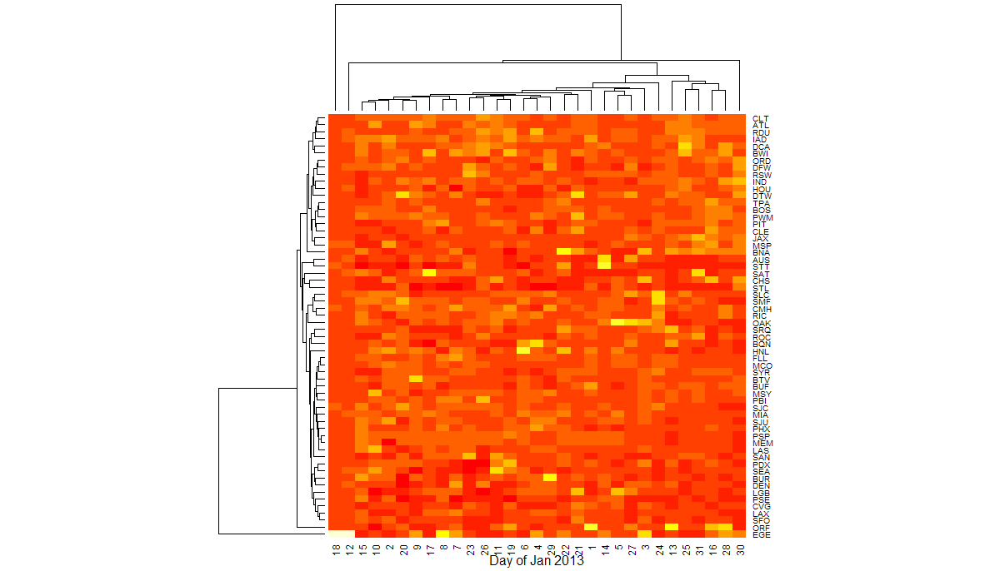

# Airline On-Time and Delay Analysis

The [Bureau of Transportation Statistics](http://www.transtats.bts.gov/OT_Delay/OT_DelayCause1.asp) (BTS) reports data on on-time and delay flight performance. 
For the first two months of this year, an estimated quarter of all flights are delayed by more than 15 minutes, with delays attributable to carrier delays, late aircraft arrival, security delays, extreme weather, or National Aviation System (NAS) delays.
Although extreme weather events often receive the most media attention, they caused a delay in less than 1% of flights, whereas non-extreme weather accounted for delays in almost 4 times as many flights.
Additionally, non-weather causes, particularly late aircraft arrival and carrier delays, account for the majority of delays.

The map of the on-time performance of departures from airports in continental USA, over a one month period in January 2013, shows that the number of delays and the average duration of a flight delay varies greatly by airport. Larger dots denote a higher proportion of delayed flights at that airport (delayed by >15 minutes). The color shows the mean delay time (in minutes), ranging from short delays (blue) to long delays (red). 

Such analysis is useful for suggesting to a traveler to avoid transiting in airports that are notorious for delays. How much transit time should a traveller allows during travel planning? Airlines also benefit from knowing how best to route their aircrafts to reduce delay propagation. Can airlines optimally use weather and delay information to optimally rereoute their aircrafts in real time?
Understanding occurance and causes of delay is essential for travel planning and airline operations. 

In this report, we perform exploratory analysis to identify the factors associated with flight delays, and in particular the effect of weather on delay times. 

### Data description and source

We focus on on-time flight data for flights on January 2013. The data were downloaded from the [BTS website](http://www.transtats.bts.gov/OT_Delay/OT_DelayCause1.asp). Features include flight date, carrier code and flight number, IATA airport codes of the origin and destination airports, departure and arrival times and duration of delay.

Daily weather data for Januray 2013 is obtained from the [NOAA website](http://www.ncdc.noaa.gov/cdo-web/datasets).
The dataset contains daily data on precipitation, temperature, windspeed, inclement weather categories. The features include precipitation, maximum and minimum temperatures, average and fastest 2-minute wind speeds, as well as the presence of weather events such as fog, sleet, mist, drizzle, rain and snow.

## Daily delay statistics 

On-time performance at an airport varies on a daily basis.
At the John F. Kennedy Airport (JFK) in New York City, the incidence of delayed departures in January 2013 changes daily, with more than usual flights experiencing major delays on certain days, such as on Jan 13 and during the last week of the month.
(Three outliers with delayed departure longer than 500 minutes were discarded from the boxplot)

Such trends in the daily changes in delay times may be explained by temporally dependent factors such as weather.
As is common knowledge, major delays often occur during inclement weather. 
The NOAA weather data indicates that the major delays at JFK occured when the airport experienced some combination of high winds, heavy fog, mist, rain and snow.

### Effect of weather on flight delays

We dig deeper into the relationship between flight delays out of JFK and weather elements such as precipitation and wind speed.
January 2013 was a relatively mild winter, which allows us to hone in on non-extreme weather effects.
The covariance plot suggests negligible correlation between mean delay times and precipitaion `PRCP`, but reveals a possible positive correlation between mean delay times and maximum 2-minute wind speed `WSF2` and average wind speed `AWND`. 

To test the relationship between delays and weather, we fit a linear model (`lm` in `R`) for mean delay times to 3 features, `PRCP`, `TMAX`, `AWND`, as well as the following 6 logical (0 or 1) features, Fog `WT01`, Sleet `WT04`, Mist `WT13`, Drizzle `WT14`, Rain `WT16`, Snow `WT18`. 
(The variables `WSF2` and `TMIN` are highly correlated with `AWND` and `TMAX`, respectively, and are left out to avoid confounding factors.)
The linear model is

`DELAY` = 1.77 + 0.011`PRCP` - 0.045`TMAX` + 0.13`AWND` + 4.1`WT01` + 13.3`WT04` + 7.1`WT13` + 10.5`WT14` - 7.7`WT16` - 4.0`WT18`

The features `AWND` is significant at the 0.01 level and `TMAX`, `WT14` and `WT16` are significant at the 0.05 level.
Interestingly, windspeed is the most significant relationship with the length of delays, more so than precipitation!

### Covariance analysis by airport

Flight delays are dependent on factors at both the origin and destination. 
On any given day, flights originating from the same geographical region may experience similar weather-related delays, leading to strong spatial correlation between daily flight delays of nearby airports.
This correlation is illustrated in the following heatmap of the mean delay time by airport and day of the month. 

Flights into a single destination, JFK, were used to generate the heatmap, to control for weather effects at the destination. 
Many of the clusters in the dendrogram contain airports within the same geographical regions: SFO, LAX on the Pacific Coast; SEA and PDX on the Pacific Northeast; CLE, PIT in the Midwest; RDU, ATL, CLT in the Southeast.
This means that the daily delay patterns of flight delays from airports in a cluster are similar.
Although this analysis hints at geography affecting flight delays, its effect may be through an intermediate variables such as weather. Further analysis using weather data at each of the origin and destination airports is needed to better understand the effect of weather.

## Conclusions

Our exploratory analysis suggests that delays are related to weather elements such as windspeed, and that geography, possibly through the effect of weather, may play a role in flight delays.
Our analysis provides a starting point for further analyses, for example, to include other factors such as the volume of flights at an airport or time of day, or to include detailed real-time weather information at origin and destination airport.

